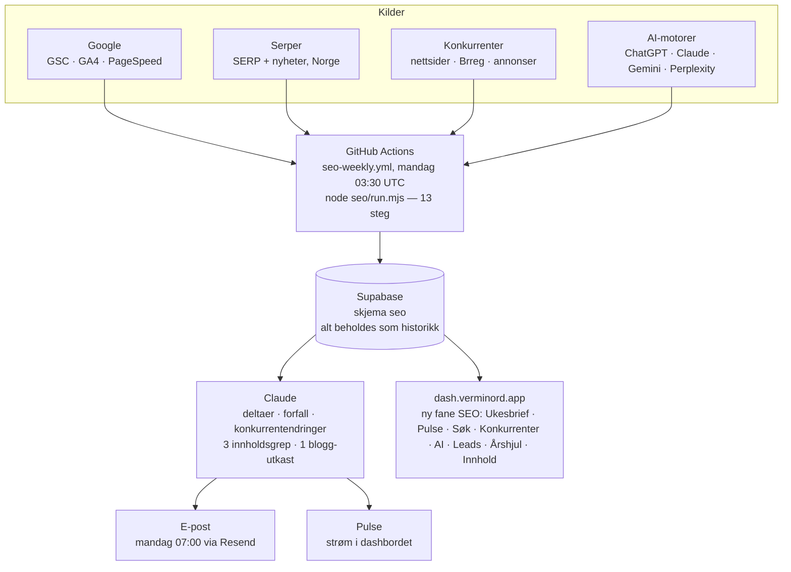

# Verminord SEO-agent — plan

*Skrevet 2026-09-04. Status: forslag til godkjenning. Ingen kode er skrevet ennå.*

Dette dokumentet er planen Martin godkjenner. `MASTER-PROMPT.md` i samme mappe er
prompten som bygger alt i én økt når planen er godkjent. `SETUP-CHECKLIST.md` er
det Martin selv må gjøre (kontoer og nøkler, ca. 45 minutter med klikking).

---

## 0. Kort fortalt

**Hva du får:** Hver mandag kl. 07:00 (norsk tid) kommer en e-post på norsk,
maks ~600 ord, som sier hva som skjedde i søk forrige uke, hva konkurrentene
gjorde, om ChatGPT/Claude/Gemini/Perplexity nevner Verminord, hvilke nyheter og
regelendringer som betyr noe, hvilke nye leads som dukket opp, og tre konkrete
innholdsgrep for uka. Alt bak e-posten ligger i en ny fane «SEO» på
dash.verminord.app, med historikk uke for uke.

**Hva det koster:** Under 100 kr/mnd i API-bruk. Ingen nye abonnementer med
månedspris. GitHub Actions og Supabase er allerede gratis nok.

**Hva du må gjøre selv:** Opprette en Google Cloud-tjenestekonto og gi den
lesetilgang til Search Console og GA4, hente fire API-nøkler (Serper, OpenAI,
Gemini, Perplexity), og lime dem inn som GitHub-secrets. Alt er beskrevet i
`SETUP-CHECKLIST.md`. Agenten går uansett: mangler en nøkkel, hopper den over
den delen og sier det i brevet, i stedet for å stoppe.

**Hva jeg trenger svar på:** Fire avgjørelser i kapittel 9. Alle har et
forhåndsvalg, så «kjør» er et gyldig svar.

---

## 1. Hva jeg fant

### 1.1 Det som allerede finnes (og gjenbrukes)

Repoet er ikke tomt. `dash.verminord.app` er en Next.js-app med det meste av
rørleggingen på plass:

| Finnes | Hvor | Gjenbrukes til |
|---|---|---|
| Planlagte jobber fra GitHub Actions (Vercel Hobby avviser cron oftere enn daglig) | `.github/workflows/scheduled-jobs.yml` | Mønsteret for ukejobben. Ny, egen workflow-fil. |
| Claude-klient uten avhengigheter, med strukturert JSON-utdata og retry | `lib/ai.js` | Ukesbrevet, nyhetsfiltrering, lead-scoring, innholdsutkast |
| Postgres-klient mot Supabase transaction pooler (`ftjxpivxeavxdgcfpsba`) | `lib/db.js` | Samme database, nytt skjema `seo` |
| Helsetabell for integrasjoner med `tracked()` | `lib/integrations.js`, `dash.integrations` | Hver innsamler registrerer seg som `seo:gsc`, `seo:serp` osv. Rødt i Brief hvis noe feiler stille. |
| E-post via Resend (`RESEND_API_KEY`, `ALERT_EMAIL`) | `app/api/health/check/route.js` | Mandagsbrevet. Samme avsender. |
| Migrasjonskonvensjon `NNN_*.sql`, idempotent, kjørt med psql | `dash-scripts/migrations/` | Migrasjon `008_seo.sql` |
| Én-fils frontend med nav-grupper og Brief-mønster | `app/page.js` (4266 linjer) | Ny seksjon «SEO» i `NAV_ARBEID` |
| Ukeplan med «Fredag: innhold + ukeoppsummering» | `dash-scripts/seed-ukeplan.sql` | Brevet kommer mandag, så fredag har du grunnlag for ukeoppsummering og neste ukes innhold |

To regler fra repoet som binder alt nytt: databasekall må gå sekvensielt (aldri
`Promise.all` mot pooleren), og alt brukerrettet er på norsk bokmål.

### 1.2 Verminords egen web-tilstedeværelse

| Domene | Hva | Merknad |
|---|---|---|
| `verminord.com` | Wix Premium, Velo på. Apper: Promote SEO, Forms, Invoices. | **Ingen Wix Stores** (D2C på vent, stemmer). **Ingen Wix Blog.** Språk/region i Wix står som **engelsk / USA** selv om innholdet er norsk. Det er et konkret SEO-problem å rette på dag én. |
| `verminord.no` | Landingsside-prototype i PR #38 (ikke merget). Tabellen `public.web_leads` forventer kalkulator-leads derfra. | Uklart om den er live. Se avgjørelse 1. |
| `dash.verminord.app` | Internt dashbord (denne appen) | Får SEO-fanen |

### 1.3 Konkurrentbildet for vermikompost i Norge

Søkt bredt på «vermikompost», «meitemarkkompost», «markkompost», «biohumus»,
«worm castings norge» og forhandlerkjedene. Dette er startlista agenten
overvåker fra uke én. Den utvider lista selv: ethvert domene som dukker opp i
topp 10 på et sporet søkeord blir automatisk lagt til som «SERP-konkurrent».

**Norske produsenter (direkte konkurrenter)**

| Aktør | Domene | Hva jeg vet |
|---|---|---|
| Mark og Grøde | markoggrøde.no | Kaller seg «Norges første produksjonsanlegg for meitemarkkompost». Selger 5 L og bulk. Nærmest Verminord i posisjonering. |
| Reve Kompost AS | revekompost.no | **Klepp, Jæren.** Levende jord, kompost, Hungrybin-kasser, meitemark, nettbutikk og forhandlere. Lokal nabo. |
| Edelmark AS | edelmark.no | Kompostmark (Eisenia) og en betalt vermikompost-guide. Grunnlegger Alene Tesfamichael. Mer «mark» enn «kompost». |
| Jordkompaniet AS | (ingen nettside funnet) | Registrert 2001, Søreidgrend/Bergen, gjødselbransjen. Du nevnte dem, jeg fant ikke produkter på nett. Se avgjørelse 2. |

**Importerte merker og distributører (konkurrerer om samme hylle og samme søk)**

| Aktør | Domene | Hva jeg vet |
|---|---|---|
| Grønn Vekst AS | gronnvekst.no | Norges største produsent av kompostjord (250 000 tonn/år, 20 anlegg, HK Grimstad). Selger «Vermikompost» 5 L spann (produsert av Vermigrand, Østerrike), frakt 99 kr. **Sterkeste organiske konkurrent på ordet «vermikompost».** |
| Nelson Garden (SE) | nelsongarden.no | «Biohumus Terra» 5 L (219–239 kr) og «Biohumus vermikompost». Den mest utbredte hyllevaren: Garden Living, Din Kjøkkenhage, Nygård Hagebruk (hagebruk.no), Odla m.fl. |
| Plagron (NL) | via mikrogartneriet.no | «Mega Worm» 25 L. Growshop-segmentet. |
| Soil Ninja (UK) | via planteliv.no | «Worm Castings» for stueplanter. |

**Nettbutikker som lister vermikompost (overvåkes for pris og lagerstatus)**

gardenliving.no · dinkjokkenhage.no · hagebruk.no · spiselighage.no ·
drivhussenter.no · planteliv.no · mikrogartneriet.no · zenso.no · plukkselv.no,
pluss Verminords egne forhandlerkanaler (Dyrkeland, Gartnerbutikken, Smartvekst)
for å se om VermiCast er listet og på lager, og kjedene Plantasjen, Hageland,
Felleskjøpet og Mester Grønn for kategori-tilstedeværelse.

**Kunnskapskilder som rangerer på søkene (ikke konkurrenter, men de tar plassen)**

permakultur.no, NIBIO, NLR, Skolehager i Norge, Hagepraten-forumet, Mattilsynet.

### 1.4 Regelverk og nyheter som skal følges

- Ny **gjødselvareforskrift** og **gjødselbrukforskrift** trådte i kraft 1. februar 2025. Fra 2026 gjelder strengere renhetskrav (plast < 2,5 per kg TS). Mattilsynets veileder og høringer er kilden.
- Kilder agenten leser hver uke: Mattilsynet (gjødsel, jord og dyrkingsmedier + høringer), Landbruksdirektoratet, Debio, NIBIO, NLR, regjeringen.no (høringer), pluss Google Nyheter på søkeordsettet. Claude filtrerer på relevans for Verminord, økologisk jordbruk og vermikompost. Det som ikke er relevant, kastes.

### 1.5 Datakilder og hva de koster

| Kilde | Brukes til | Tilgang | Kostnad |
|---|---|---|---|
| Google Search Console API | Posisjoner, klikk, visninger per søkeord og side. Innholdsforfall. Ord like utenfor topp 10. | Tjenestekonto (ingen OAuth-flyt) lagt til som bruker på property | Gratis |
| GA4 Data API | Økter, brukere, kanaler, landingssider, konverteringer | Samme tjenestekonto lagt til på GA4-property | Gratis |
| PageSpeed Insights API | Core Web Vitals, ytelsesscore mobil/desktop for forsiden + topp 5 sider | Valgfri nøkkel | Gratis |
| Serper.dev | Google-SERP for Norge (gl=no, hl=no), topp 20 + «Folk spør også», Google Nyheter | API-nøkkel | 2 500 gratis søk, deretter 50 USD for 50 000. ~100 søk/uke. |
| Brønnøysundregistrene | Selskapsfakta, ansatte, siste årsregnskap (omsetning) for konkurrenter. Nye selskaper i utvalgte NACE-koder og kommuner (leads). | Åpne API-er, ingen nøkkel | Gratis |
| Konkurrentenes egne sider | Pris, lagerstatus, nye blogginnlegg (sitemap), hvilken plattform de kjører | Vanlig HTTP + cheerio, Playwright som reserve | Gratis |
| Meta Ad Library (web) og Google Ads Transparency Center (web) | Aktive annonser per konkurrent | Playwright mot de offentlige sidene. Meta sitt API dekker bare EU for kommersielle annonser, Norge er usikkert, så web-siden brukes. | Gratis, men skjørt (se risiko) |
| OpenAI, Gemini, Perplexity, Anthropic | AI-synlighet: stilles ~14 norske spørsmål hver uke med websøk påslått | Fire nøkler, Anthropic finnes | Noen kroner/uke |
| Claude (Anthropic) | Brevet, innholdsgrep, nyhetsfilter, lead-scoring, blogg-utkast | `ANTHROPIC_API_KEY` finnes | ~10–30 kr/uke med Opus |

---

## 2. Arkitektur

Tre valg som avviker fra skissen fra forrige økt, og hvorfor:

1. **Innsamlerne kjører i GitHub Actions, ikke i Vercel.** Vercel Hobby gir
   10–60 sekunder per kall. Å hente 16 måneder GSC, kjøre 100 SERP-søk, snurre
   opp Playwright mot Meta og spørre fire AI-motorer tar 10–15 minutter.
   Actions har 6 timer. Dashbordet leser bare fra databasen, som i dag.
2. **JavaScript, ikke Python.** Repoet er JavaScript. Én språk betyr at
   `lib/ai.js` (modell-id ett sted), `lib/db.js` og `lib/integrations.js`
   gjenbrukes direkte, og at neste Claude Code-økt ikke må holde to verdener i
   hodet. Det krever `"type": "module"` i `package.json` og at én import i
   `lib/integrations.js` byttes fra `@/lib/db` til `./db`.
3. **Alt degraderer pent.** Hver innsamler er selvstendig. Mangler nøkkelen,
   skriver den «ikke konfigurert» til Pulse og går videre. Feiler den, blir
   `seo:<navn>` rød i helsebanneret på Brief, og brevet sendes likevel med det
   som finnes. Brevet skal aldri utebli fordi Meta endret HTML-en sin.

---

## 3. Det agenten gjør hver uke (13 steg, i rekkefølge)

| # | Steg | Henter | Skriver til |
|---|---|---|---|
| 1 | `gsc` | Siste 7 hele dager (GSC ligger 2–3 dager etter) per søkeord × side × land × enhet. Første kjøring: 16 måneder bakover. | `seo.gsc_daily` |
| 2 | `ga4` | Økter, brukere, engasjerte økter, konverteringer per kanal og landingsside | `seo.ga4_daily` |
| 3 | `psi` | Forsiden + de 5 sidene med flest klikk, mobil og desktop | `seo.psi_audits` |
| 4 | `serp` | ~30 sporede søkeord, topp 20 organisk + «Folk spør også» + nyheter. Nye domener i topp 10 legges til som SERP-konkurrenter. | `seo.serp_snapshots`, `seo.competitors` |
| 5 | `competitors` | Produktsider: pris, «på lager»/«utsolgt». Sitemap og bloggindeks: nye innlegg. HTML-fingeravtrykk: Shopify/Woo/Wix/Mystore/24Nettbutikk + GA4/Meta-piksel/Klaviyo. | `seo.competitor_snapshots`, `seo.competitor_posts`, `seo.competitor_tech` |
| 6 | `brreg` | Enhetsregisteret + Regnskapsregisteret per org.nr. Månedlig er nok. | `seo.company_facts` |
| 7 | `ads` | Aktive annonser per konkurrent i Meta Ad Library og Google Ads Transparency Center. Første gang sett, sist sett, tekst, landingsside. | `seo.ads` |
| 8 | `news` | Google Nyheter (Serper) på søkeordsettet + RSS fra kildene i 1.4. Claude gir relevans 0–5 og én setning «hvorfor det betyr noe». Under 3 kastes. | `seo.news` |
| 9 | `ai` | 14 norske spørsmål (og 2 engelske) til fire motorer med websøk. Lagrer hele svaret, om Verminord nevnes, hvor i svaret, hvilke konkurrenter som nevnes, hvilke URL-er som siteres. | `seo.ai_visibility` |
| 10 | `scout` | Brreg: nyregistrerte selskaper siste uke i NACE-koder for hagesentre, planteskoler, gartnerier, anleggsgartnere, økologisk landbruk, i Rogaland først. Serper: «hagesenter Rogaland» osv. Claude scorer mot ideell kundeprofil. Dedupliseres mot `dash.partners` og tidligere leads. | `seo.leads` |
| 11 | `analyze` | Regner deltaer (uke mot forrige uke og mot 4-ukers snitt), innholdsforfall (sider med > 30 % fall i klikk mot 8-ukers snitt), muligheter (ord i posisjon 8–20 med visninger, rangert på visninger × gevinst ved å nå topp 5 ÷ avstand), konkurrentendringer (pris, lager, nye innlegg, nye annonser), AI-synlighetsscore per motor. | `seo.pulse` |
| 12 | `brief` | Claude får analysen + årshjulet for de neste 6 ukene + stemmereglene, og skriver brevet som JSON + markdown: tallene, bevegelsene, muligheter, konkurrenter, AI, nyheter, leads, teknisk, **tre innholdsgrep**, og **ett blogg-utkast** (600–1200 ord, ett hovedsøkeord). | `seo.briefs`, `seo.content_drafts` |
| 13 | `send` | Resend, norsk, HTML + ren tekst, lenke til SEO-fanen | `seo.briefs.sent_at` |

Alt kan kjøres manuelt fra Actions-fanen («Run workflow» → velg steg eller
`all`), og alt kan kjøres på nytt uten å lage dubletter.

## 4. Mandagsbrevet

Rekkefølgen er valgt slik at det viktigste står øverst hvis du bare leser de
første linjene på telefonen. Under 600 ord. Detaljene ligger i dashbordet.

1. **Én setning om uka.** («Rolig uke i søk, men Grønn Vekst er utsolgt på 5 L og du ligger på 11. plass på ‘vermikompost’.»)
2. **Tallene.** Klikk, visninger, CTR, snittposisjon, økter, leads: denne uka mot forrige og mot 4-ukers snitt.
3. **Bevegelser.** Søkeord opp/ned, sider som forfaller, nye sider indeksert.
4. **Muligheter.** Fem ord like utenfor topp 10, med hvilken side som skal styrkes og hva som skal gjøres.
5. **Konkurrenter.** Tabell side om side for 10 kjerneord (Verminord mot 3–5 domener). Pris- og lagerendringer. Nye blogginnlegg. Nye annonser.
6. **AI-synlighet.** Andel spørsmål der Verminord nevnes, per motor, mot forrige uke. Hvem nevnes i stedet.
7. **Nyheter og regelverk.** 0–3 saker med «hvorfor det betyr noe for deg».
8. **Leads.** Topp 3 nye, med begrunnelse.
9. **Teknisk.** Core Web Vitals-endringer, brutte lenker, ting som er ødelagt.
10. **Tre innholdsgrep.** Konkrete: tittel, søkeord, vinkel, hvilken side, hvorfor akkurat nå (årshjulet). Aldri «skriv mer innhold».
11. **Neste 4 uker i årshjulet.**

Ulikt vaktbikkja er dette brevet ment å komme hver uke. Det er kort nettopp
derfor.

## 5. Dashbordet: ny fane «SEO»

Én ny seksjon i `NAV_ARBEID`, med underfaner i samme stil som Fôring & batcher:

| Underfane | Innhold | Kan redigeres |
|---|---|---|
| Ukesbrief | Siste brev + arkiv uke for uke | — |
| Pulse | Kronologisk strøm av alt agenten fant og gjorde. Filter på kilde og alvorlighet. Marker som lest. | Lest-status |
| Søk | GSC-trender (samme SVG-graf som Brief), sporede søkeord med posisjon over tid, forfall-liste, mulighetsliste | Legg til / fjern søkeord |
| Konkurrenter | Per konkurrent: SERP-posisjoner mot Verminord, pris/lager-historikk, siste innlegg, teknologi, Brreg-fakta, annonser | Legg til / fjern konkurrent og URL-er |
| AI-synlighet | Score per motor over tid, siste svar per spørsmål, hvem som siteres | Legg til / fjern spørsmål |
| Leads | Liste med score og status (ny · kontaktet · ikke aktuell · kunde) | Status |
| Årshjul | År-, kvartal- og månedsvisning av sesonger, kampanjer, frister | Full CRUD |
| Innhold | Utkast fra agenten (blogg, sosialt) med status (utkast · godkjent · publisert · forkastet). Godkjent tekst kopieres inn i Wix. | Status og tekst |

Brief-siden får én ny linje i KPI-raden («Søk siste 7 d») og en «Siste fra
SEO-agenten»-blokk på tre rader som peker til Pulse, samme mønster som
innboks-digesten.

## 6. Datamodell (skjema `seo`, migrasjon `008_seo.sql`)

Alt beholdes som historikk. Ingen sletting, ingen overskriving av uker.

| Tabell | Innhold |
|---|---|
| `seo.runs` | Én rad per steg per kjøring: start, slutt, status, feil, statistikk |
| `seo.sites` | Domener som spores (GSC-property, GA4-property-id) |
| `seo.keywords` | Sporede søkeord med klynge og prioritet |
| `seo.competitors` | Navn, domene, org.nr, type (produsent · merke · forhandler · serp · kunnskap), URL-er (produkt, blogg, sitemap), Meta-side-id, aktiv, oppdaget fra |
| `seo.ai_prompts` | Spørsmålene som stilles AI-motorene |
| `seo.gsc_daily` | dato × side × søkeord × land × enhet → klikk, visninger, CTR, posisjon |
| `seo.ga4_daily` | dato × dimensjon → økter, brukere, engasjerte, konverteringer |
| `seo.psi_audits` | url × strategi → score, LCP, CLS, INP, muligheter |
| `seo.serp_snapshots` | uke × søkeord × plassering → url, domene, tittel, type |
| `seo.competitor_snapshots` | uke × konkurrent × url → pris, på lager, tekst, hash, endret |
| `seo.competitor_posts` | Nye innlegg per konkurrent, første gang sett |
| `seo.competitor_tech` | Plattform og signaler per uke |
| `seo.company_facts` | Brreg: NACE, ansatte, stiftet, omsetning, resultat, regnskapsår |
| `seo.ads` | plattform × konkurrent × annonse-id → først/sist sett, aktiv, tekst, landingsside |
| `seo.ai_visibility` | uke × motor × spørsmål → nevnt, plassering, konkurrenter nevnt, siteringer, svar, modell |
| `seo.news` | url → tittel, kilde, dato, sammendrag, relevans, tagger |
| `seo.leads` | org.nr / url → navn, type, region, score, begrunnelse, status |
| `seo.pulse` | tidspunkt, uke, kilde, type, alvorlighet (info · notis · viktig), tittel, tekst, data, lest |
| `seo.briefs` | uke → generert, modell, markdown, JSON, sendt |
| `seo.content_drafts` | uke, type, søkeord, tittel, tekst, status |
| `seo.calendar` | Årshjul: tittel, type (sesong · kampanje · frist · hendelse), fra, til, notat, gjentas årlig |

Skjemaet eksponeres ikke via Supabase sitt REST-API (samme som `dash`), og
appens databaserolle får rettigheter i migrasjonen.

## 7. Startdata (seedes i migrasjonen, redigeres i dashbordet etterpå)

**Søkeord (~30):** vermikompost · vermikompost kjøp · norsk vermikompost ·
meitemarkkompost · markkompost · mark kompost · meitemark gjødsel · ormekompost ·
worm castings norge · biohumus · økologisk gjødsel · organisk gjødsel ·
jordforbedring · kompost til chili · kompost til tomat · vermikompost te ·
kompostte · AACT · hva er vermikompost · hvordan bruke vermikompost ·
vermikompost vs kompost · jord til chili · økologisk pottejord · gjødsel til
potteplanter økologisk · mikroliv i jord · regenerativt jordbruk gjødsel · Debio
gjødsel · vermikompost Rogaland · vermikompost Jæren · vermikompost Stavanger ·
Verminord · VermiCast.

**AI-spørsmål (14 norske + 2 engelske):** «Hvor kan jeg kjøpe vermikompost i
Norge?» · «Hvilke norske produsenter lager vermikompost?» · «Hva er den beste
vermikomposten i Norge?» · «Anbefal en økologisk gjødsel til chili i potte» ·
«Hva er forskjellen på vermikompost og vanlig kompost?» · «Finnes det
norskprodusert meitemarkkompost?» · «Hvilken jordforbedring bør jeg bruke i
drivhus på Vestlandet?» · «Hvem selger vermikompost i Rogaland?» · «Er
vermikompost tillatt i økologisk dyrking i Norge?» · «Hvordan lager jeg
kompost-te av vermikompost?» · «Hva koster vermikompost i Norge?» · «Beste
økologiske gjødsel til tomater i drivhus» · «Hva er VermiCast?» · «Hva er
Verminord?» · «Where can I buy vermicompost in Norway?» · «Norwegian
vermicompost producers».

**Konkurrenter:** tabellene i 1.3.

**Ideell kundeprofil for Scout (fra forhandler-arbeidet):** hagesentre og
plantebutikker (NACE 47.761), planteskoler og gartnerier (01.30, 01.1x),
anleggsgartnere (81.30), landbruksvarehandel (46.2x / 47.7x), økologiske gårder
og andelslandbruk, urbane dyrkingsprosjekter, skolehager. Rogaland først
(kommunenummer 11xx), deretter Vestland, Agder, Østlandet.

**Årshjul (forslag, alt kan endres):**

| Måned | Sesong / hendelse |
|---|---|
| Jan–Feb | Chili-såing starter. Frøkataloger. Hagesentrene forhåndsbestiller vårvarer: **B2B-pitch-vindu.** |
| Mar–Apr | Vår-stell før planting. Påske. Hagemessen (Lillestrøm). |
| Mai | 17. mai. Utplanting. Salgstopp i hagesentre. |
| Jun–Jul | Toppdressing i drivhus. Sommerferie (lavere trafikk). |
| Aug | Høsting, tomat, chili. |
| Sep–Okt | Høst-tilbakeføring til jorda. Løvmold-innsamling med kommunen. Plen høst. Dyrsku'n (Seljord). |
| Nov | Black Friday i nettbutikkene. Gaver til dyrkere. |
| Des | Vinterkompost-innhold. Årsoppsummering. |
| Løpende | Debio-revisjon, Mattilsynet-rapportering, gjødselvareregister (datoer bekreftes av Martin) |

## 8. Det Martin må gjøre selv

Se `SETUP-CHECKLIST.md`. Kort: én Google Cloud-tjenestekonto med lesetilgang
til Search Console og GA4, fire API-nøkler, ni GitHub-secrets, og to rettinger
i Wix (språk/region til norsk, bekreft at GA4 er koblet). Ingenting av dette
krever kode.

## 9. Avgjørelser jeg trenger (med forhåndsvalg)

1. **Hvilket domene er hovedproperty i Search Console?** Forhåndsvalg:
   `verminord.com` nå, `verminord.no` legges til når/hvis den er live. Agenten
   støtter flere.
2. **Jordkompaniet:** er det Jordkompaniet AS i Bergen (org. 2001)? Har de en
   nettside eller nettbutikk med vermikompost? Forhåndsvalg: legges inn med
   Brreg-fakta bare, til du gir meg en URL. Andre konkurrenter du vet om som
   ikke står i 1.3, tar jeg med.
3. **Full eller lett API-oppsett?** Full = Google + Serper + OpenAI + Gemini +
   Perplexity (AI-synlighet på fire motorer). Lett = Google + Serper + Anthropic
   (AI-synlighet bare på Claude, resten av brevet upåvirket). Forhåndsvalg:
   full, fordi ChatGPT står for over halvparten av AI-trafikken og er den
   motoren det er mest verdt å måle.
4. **Offentlig repo.** Konkurrentlista og spørsmålene ligger i repoet, som er
   offentlig. Ingenting hemmelig, men Reve Kompost kan i prinsippet lese at de
   overvåkes. Forhåndsvalg: fint, det er offentlig informasjon uansett.
   Alternativ: gjør repoet privat.

## 10. Risiko og grenser, ærlig

- **Annonseovervåking er det skjøreste.** Meta og Google endrer HTML ofte, og
  begge kan blokkere robotene i Actions. Det er bygget som best effort: feiler
  det, blir `seo:ads` gul/rød i helsebanneret og brevet sier «annonsedata
  mangler denne uka». Ingenting annet stopper.
- **«Beregnet volum solgt» er et estimat.** Brreg gir omsetning for hele
  selskapet, ikke per produkt. For Grønn Vekst er vermikompost en brøkdel av
  250 000 tonn jord. Brevet merker alltid slike tall som anslag og viser
  regnestykket.
- **Lagerstatus leses fra tekst** («utsolgt», «på lager», deaktivert
  kjøpsknapp). Første ukene må du forvente noen feillesninger; hver feil
  rettes ved å justere mønsteret for den butikken.
- **GSC-data ligger 2–3 dager etter.** Brevet mandag dekker derfor til og med
  fredag. Det er slik Google er.
- **AI-svar varierer fra gang til gang.** Én uke sier lite; trenden over 8–12
  uker er det som betyr noe. Dashbordet viser trenden, ikke bare øyeblikket.
- **GitHub-cron kan komme for sent under last.** 03:30 UTC gir tre timers
  slingringsmonn før 07:00 norsk tid.
- **Ingen automatisk publisering.** Blogg-utkast godkjennes av deg og limes inn
  i Wix. Agenten sender aldri noe til kunder og publiserer aldri selv. Samme
  grense som innboks-utkastene.

## 11. Leveranse

Én PR, bygget i én Claude Code-økt med `MASTER-PROMPT.md`. Rekkefølgen inne i
økten er valgt slik at hvert trinn kan verifiseres før neste:

1. Migrasjon `008_seo.sql` kjøres mot Supabase og verifiseres med `list_tables`.
2. `seo/`-pakken med alle 13 steg, hver testbar alene (`node seo/run.mjs --only gsc --dry-run`).
3. `seo-weekly.yml`.
4. API-ruter under `/api/seo/*`.
5. SEO-fanen i `app/page.js`, `npm run build` grønn.
6. Dokumentasjon: `seo/README.md`, avsnitt i `DASHBOARD.md`, oppdatert `SETUP-CHECKLIST.md`.

Verifikasjon før PR-en merges: kjør «Run workflow → all» manuelt med nøklene
på plass, se at brevet kommer, åpne SEO-fanen på telefonen.

## 12. Forslag utover bestillingen

- **Rett språk/region i Wix først.** Det er trolig det enkleste SEO-løftet som finnes for verminord.com akkurat nå.
- **Wix Blog** finnes ikke på siden. Innholdsgrepene forutsetter et sted å publisere. Enten aktiver Wix Blog, eller la verminord.no bli innholdssiden. Senere kan agenten publisere godkjente utkast rett til Wix via Blog-API-et.
- **Verifiser verminord.no eller .com i Resend** så brevet kommer fra `agent@verminord.no` i stedet for `onboarding@resend.dev`. To DNS-poster i Wix.
- **Supabase-advarsel, utenfor denne planen:** 25 tabeller i `dash` har RLS av. Appen bruker en egen databaserolle og skjemaet er ikke eksponert via REST, så eksponeringen er begrenset, men det bør ryddes i en egen liten PR. Det nye `seo`-skjemaet følger samme mønster som `dash` i dag, så det ikke skiller seg ut.
- **Rydd PR-lista.** 18 åpne utkast-PR-er på repoet gjør det vanskelig å se hva som er levende.
